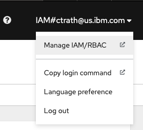
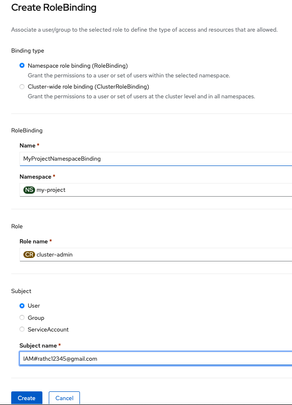
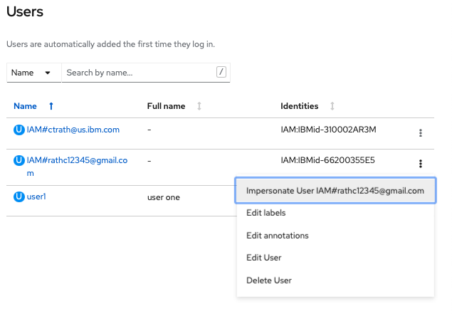

# IBM Redhat Openshift Kubernetes Service multi-tenancy configuration

This document describes how to establish multi-tenancy in an IBM Redhat Openshift Kubernetes Service cluster while providing process and network boundary controls between tenant workloads.  The following mechanisms will be utilized in order to provide multi-tenancy in your cluster:

1. Openshift projects / namespaces
2. Role-based access control (RBAC)
3. Kubernetes network policies
4. Redhat Openshift Service mesh / IBM Cloud Satellite Mesh

This document will provide examples that can be used in the `oc` command line interface (CLI), and also the Openshift Web Console.  Many of the `oc` examples in this document can also be performed in the Openshift Console UI.  Additional documents will be referenced at the end of this document which depict actions that can be done in the Openshift Web console instead of the `oc` CLI if you wish to use the Openshift web console instead.


### Openshift projects / namespaces

An Openshift project is a logical area in an Openshift cluster that is used to manage content in isolation from others.  I tend to think of a project like a directory in an operating system.  Where a directory contains files, a project can contain an array of Kubernetes resources like pods, services, configmaps, secrets, etc.  And like a directory, permissions can be applied to projects through the use of Kubernetes Role Based Access Control (RBAC), which will be described in the next section.

To create a Openshift project:
```
oc create namespace my-project
```

The above will create an empty project with the name `myProject`.  Also, in order to create the above project, you have to have role bindings enabled for the given user that has permissions to create projects, so it's recommended to create projects with an admin user.

To view that a project exists:
```
oc get namespace my-project
```

### Role-based access control (RBAC)

In order to grant privileges to users, you must first invite a user to access your cluster.  In the Openshift web console, click the `IAM#<user>` menu on the top right of the screen and select `Manage IAM/RBAC`, then click the blue `Invite Users` button.  At the next window, enter the e-mail address for the users you want to invite to the cluster, and click the blue `Invite` button on the right-hand of the screen.  You do not need to assign any additional access groups unless you want the user to have additional permissions other than access to a given namespace in the cluster and its resources.



Each user will get an e-mail to join the IBM Cloud account.  Once they get the e-mail and login to cloud.ibm.com, then can then browse to the openshift console URL directly.  Once the user has logged into the Openshift cluster console for the first time, you will see their ID under the User Management->Users selection from the hamburger menu on the top-left of the screen.

After the invited user has signed in, the admin can now assign privileges to the user.  In the hamburger menu in the Openshift web console, select User Management -> RoleBindings and click the blue `Create binding` button on the top-right of the screen.  Following the previous example, we will now grant the new user privileges to the `myProject` project.

Select and enter text into the following fields.  The text below is merely sample text and can be adjusted to whatever you wish:

- Name: `MyProjectNamespaceBinding`
- Namespace: `my-project`
- Role: `cluster-admin`
- Subject: `User`
  - Subject name: `IAM#<user>`



Click the blue `Create` button at the bottom of the screen.

Now that there is a user with cluster-admin privileges bound to the given namespace, that user can also manage users for the given namespace.  They can create RoleBindings just like the example above for other users.

As an admin of the cluster, if you wish to check the privileges of other accounts, you can impersonate the other user in the Openshift web console to see what the account has access to do.  You can perform this by going to User Management -> Users and click the 3 vertical dots in the right-hand field of the user account.  In the dropdown menu, click `Impersonate User <user>`.  Once you are done impersonating the user, you can click the `Stop Impersonation` link at the top of the screen.



### Kubernetes Network Policies

The network management plugin used in the IBM Redhat Openshift Kubernetes Service is Calico and also is used to perform network policy management in your Openshift cluster.  By default, pods in namespaces can connect to services in other namespaces.  To isolate this, a Kubernetes network policy can be applied to block all traffic to and from other namespaces.


```
kind: NetworkPolicy
apiVersion: networking.k8s.io/v1
metadata:
  name: default-deny-policy
  namespace: my-project
spec:
  podSelector:
    matchLabels: {}
  policyTypes:
  - Ingress
  - Egress
```

If you want to be less strict, the policy can be massaged to allow specific traffic of your needs to and from the namespace.


### Redhat Openshift Service mesh 

Even though the network policy should completely isolate traffic between namespaces, it's always a good idea to encrypt traffic between pods in a cluster, especially if the cluster has multiple tenants.  The recommended approach is to use Redhat Openshift Service Mesh to encrypt pod-to-pod traffic.  You can perform additional security control with istio, such as configuring ingress and egress gateways for traffic the enters or leaves your cluster and can control and view your cluster traffic patterns.

Redhat Openshift Service Mesh is based on Istio and is configured in a very similar manner to Istio.  In the near future, IBM Cloud will be releasing a feature based on Redhat Openshift Service Mesh, currently named Satellite Mesh, which will be a managed service mesh.  This feature will provide additional capabilities where the management of the Istio infrastructure is handled by the IBM Cloud. 


### References
- [Openshift Multitenancy Tutorial](https://developer.ibm.com/tutorials/multitenancy-and-role-based-access-control/)
- [Redhat Openshift Service Mesh](https://cloud.redhat.com/learn/topics/service-mesh)
- [Istio](https://istio.io/latest/about/service-mesh/)
- [Network policies](https://loft.sh/blog/kubernetes-network-policies-for-isolating-namespaces/)
- [Calico](https://projectcalico.docs.tigera.io/getting-started/kubernetes/quickstart)

